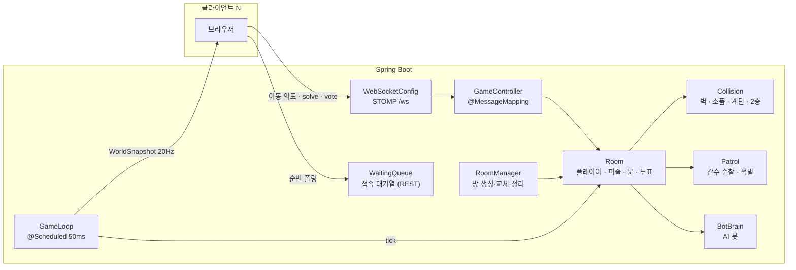
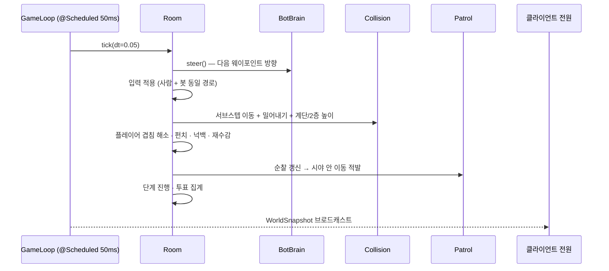
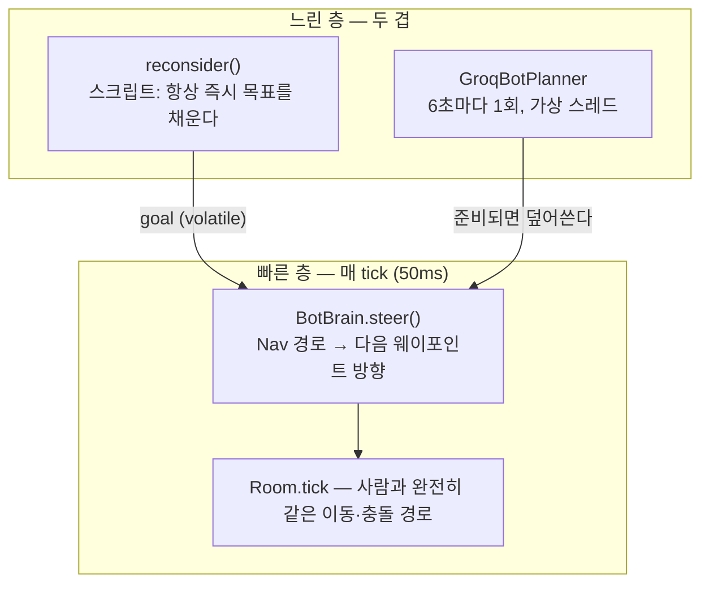

# 시야 밖으로 : Escape — 백엔드

실시간 멀티플레이 **3D 협동 방탈출** 게임의 **권위(authoritative) 서버**입니다.
플레이어 위치·퍼즐 진행·순찰·AI 봇을 서버가 확정해 20Hz로 브로드캐스트합니다.

- 데모: **https://sub.kljj.cloud**
- 짝 저장소(프론트): [`hideAndSeek_front`](https://github.com/Jakelee0424/hideAndSeek_front) — Next.js + React Three Fiber

---

## 게임 한 판

| 단계 | 이름 | 길이 | 서버가 하는 일 |
|---|---|---|---|
| `LOBBY` | 대기 중 | — | 준비 상태 집계, 전원 준비 시에만 시작 허용 (시계 안 흐름) |
| `PLAY` | 탈옥 | 15분 | 이동·충돌 확정, 퍼즐 해결 전파, 순찰 운영, 봇 구동 |
| `VOTE` | 색출 | 5분 | AI 지목 투표 집계 |
| `ENDED` | 자정 | — | 진짜 AI의 id 공개 (**이 단계에서만** 스냅샷에 실린다) |

방 정원은 **사람 3명**이고, 여기에 **AI 봇 1명**이 섞여 함께 플레이합니다.
마지막 투표에서 사람들이 그 봇을 가려내야 합니다.

---

## 기술 스택

| 영역 | 사용 |
|---|---|
| 언어 · 런타임 | Java 21 (record · pattern matching · **가상 스레드**) |
| 프레임워크 | Spring Boot 4.x (Spring Framework 7, `jakarta.*`) |
| 실시간 | Spring WebSocket + STOMP (내장 SimpleBroker) |
| 저장소 | H2 in-memory + JPA (핫 상태는 전부 메모리) |
| 빌드 | Gradle (Kotlin DSL) |
| 테스트 | JUnit 5 (`BotPunchTest` · `CollisionBoundsTest`) |
| LLM | Groq API (봇 상위 판단, 선택) |

---

## 빠른 시작

```bash
./gradlew bootRun            # http://localhost:8080
./gradlew test               # 순수 로직 테스트
./gradlew bootJar            # build/libs/game3d-server.jar
```

프론트는 `:3000`에서 띄우고 `NEXT_PUBLIC_WS_URL=ws://localhost:8080/ws`로 붙입니다.
CORS/WS 허용 오리진은 `cors.allowed-origins`입니다.

데모·검증용으로 20분을 다 기다릴 수 없을 때는 단계를 줄여 띄웁니다.

```bash
./gradlew bootRun --args='--game.phases.intro=5s --game.phases.play=20s --game.phases.vote=10s'
```

방 코드 **`TEST`** 로 들어오면 준비·시작 없이 즉시 시작하고 약 2분 15초에 결말까지 갑니다
(`game.test-room-code`, 비우면 닫힙니다).

봇 LLM은 **기본 off**입니다. 켜려면 `GROQ_API_KEY` 환경변수 + `game.bot.llm.enabled=true`.
켜두면 브라우저만 열어놔도 방마다 봇이 스폰되어 무료 한도가 샙니다.

---

## 아키텍처

### 권위 서버 모델



원칙 셋:

1. **클라이언트가 보낸 좌표는 신뢰하지 않습니다.** 받는 것은 이동 의도(방향·시점·달리기·점프)뿐이고,
   서버가 검증·충돌 해결해 다음 상태를 만듭니다.
2. **발화자·투표자·펀치 주체는 STOMP 세션에 묶인 `playerId`로 정합니다.** 페이로드의 id는 무시합니다 —
   마지막이 "말과 행동을 근거로 AI를 지목하는 투표"라 주체 위조는 게임을 통째로 무너뜨립니다.
3. **핫 상태는 메모리에.** 위치·속도 같은 값은 `Room` 안 thread-safe 컬렉션에 둡니다. H2는 영속 의미가
   있는 것만 씁니다.

### 게임 루프 (50ms tick)



- 입력이 `input-timeout-ms`(500ms) 동안 없으면 정지로 간주합니다.
- 이동은 **`MAX_STEP_M`(0.18m) 이하 조각으로 쪼개** 조각마다 충돌을 풉니다. 한 번에 풀면
  달리기 10.8m/s × 50ms = 0.54m로 벽 두께 0.4m를 넘어 **관통**합니다.
- 밀어낸 결과가 맵 밖이면 그쪽으로 보내지 않고 맵 안에 남는 가장 가까운 면으로 뱉습니다.
  담장에 붙은 소품과 경계 사이에서 밀림 ↔ clamp 무한 왕복이 나던 것을 막는 규칙입니다.

### 스냅샷 설계

`WorldSnapshot`은 대역폭을 아끼려 **매 tick 싣는 것**과 **바뀔 때만 싣는 것**을 나눕니다.

| 매 tick | 바뀔 때 · 입장 시에만 |
|---|---|
| `states`(위치) · `openDoors` · `solvedIds` · `guards`(순찰 중) | `roster` · `phase` · `phaseRemainMs` · `votes` · `readyIds` · `assist` |

- 카운트다운은 **남은 시간**(`phaseRemainMs`)으로 한 번만 주고 클라가 자체 진행합니다. 절대 시각을
  주면 클라 시계 오차를 그대로 탑니다.
- `aiId`는 **`ENDED`에서만** 실립니다. 그 전에 주면 투표가 무의미해집니다.
- 필드를 더할 때는 **박싱 타입**(`Long`/`Boolean`)을 씁니다 — `NON_NULL` 생략이 먹으려면 null을
  담을 수 있어야 합니다.

### 봇 길찾기 — 벽에서 구운 격자

손으로 관리하던 웨이포인트 그래프를 걷어내고, `Collision`의 벽·소품에서 **0.5m 균일 격자**를
자동으로 굽습니다. 레이어 둘(1층 / 수감동 2층 슬래브)이고, 이웃 이동 조건은 사람의 계단 스냅과
같은 **높이차 ≤ `STEP_UP`** 입니다. 그래서 계단이 저절로 이어집니다.

웨이포인트 시절엔 노드를 빠뜨려도 **조용히 실패**했습니다(잠긴 방 안이 최근접 노드라 봇이 문 앞에서
110초 정지한 사고 등). 지금은 부팅 때 `reachabilityReport`가 통행칸 수·POI 상호 도달성·2층 도달성을
전수 검사해 로그로 남깁니다 — **맵을 고친 뒤 이 로그를 보는 것이 회귀 검사입니다.**

### AI 봇 — 2계층 브레인



- **tick 스레드는 LLM을 절대 기다리지 않습니다.** 호출이 늦거나 실패하면 빠른 층이 마지막 목표를
  계속 실행합니다 — 봇이 멈추는 경우는 없습니다.
- 모델을 **라운드 로빈**으로 돌립니다. Groq 무료 한도는 모델별로 따로 걸리기 때문입니다.
  (⚠️ 같은 계정에서 키를 여러 개 만드는 건 소용없습니다 — 한도는 키가 아니라 조직 단위입니다.)
  429를 받은 모델은 60초 건너뜁니다.
- **정체가 드러나지 않게 하는 장치들**이 곳곳에 있습니다: 자물쇠 앞에서 4~9초 "푸는 척" 머물고
  (고정값이면 그 규칙성 자체가 단서), 순찰 때 8% 확률로 실수하고(한 번도 안 걸리면 = AI),
  **먼저 때리지 않고 맞았을 때만 70% 확률로 한 대 돌려줍니다**(반드시 되받아치면 = AI).

### 접속 대기열

정원(`game.queue.capacity`, 기본 8)을 넘으면 FIFO로 줄을 세웁니다. 순번은 **REST 1초 폴링**입니다 —
아직 게임에 못 들어온 사람이 쓰는 것이라 게임 연결(STOMP) 위에 얹으면 앞뒤가 바뀝니다.

관문은 **STOMP `join`에서도** 검사합니다. REST만 두면 대기 화면을 건너뛰고 곧장 붙는 걸 막을 수 없어
게이트가 장식이 됩니다.

---

## STOMP · REST 규약

STOMP 엔드포인트: `/ws`

| 방향 | 목적지 | 페이로드 | 비고 |
|---|---|---|---|
| 클라 → 서버 | `/app/rooms/{id}/join` | `JoinMessage(id, nick, token)` | 대기열 토큰 검사 |
| 클라 → 서버 | `/app/rooms/{id}/input` | `InputMessage(move, rotationY, sprint, jump, seq)` | **id 없음** (세션에서) |
| 클라 → 서버 | `/app/rooms/{id}/solve` | `SolveMessage(objectId)` | 푼 사람은 세션에서 |
| 클라 → 서버 | `/app/rooms/{id}/ready` · `/start` | `ReadyMessage` · 없음 | 전원 준비 시에만 시작 |
| 클라 → 서버 | `/app/rooms/{id}/vote` | `VoteMessage(targetId)` | 투표자는 세션에서 |
| 클라 → 서버 | `/app/rooms/{id}/punch` | 없음 | 대상·넉백은 서버가 계산 |
| 클라 → 서버 | `/app/rooms/{id}/chat` · `/door` | `ChatMessage` · `DoorMessage` | 120자 절단 · 700ms 도배 제한 |
| 서버 → 클라 | `/topic/rooms/{id}/state` | `WorldSnapshot` | 20Hz |
| 서버 → 클라 | `/topic/rooms/{id}/chat` | `ChatEvent` | 스냅샷에 싣지 않는다 |

REST — `POST /api/queue` · `GET /api/queue/{playerId}` · `DELETE /api/queue/{playerId}`

> ⚠️ `spring.jackson.deserialization.fail-on-null-for-primitives: false` 를 지우지 마세요.
> 켜져 있으면 새 primitive 필드를 안 보내는 구버전 클라의 **메시지 전체가 거부**됩니다.
> 실제로 `InputMessage`에 `sprint`/`jump`를 추가했을 때 이동이 통째로 막힌 적이 있습니다.

---

## 주요 설정 (`application.yml`)

| 키 | 기본값 | 설명 |
|---|---|---|
| `game.speed` · `sprint-multiplier` · `jump-speed` · `gravity` | 6.0 · 1.8 · 6.0 · 18.0 | **프론트 `LocalPlayer.tsx`와 이중 관리** |
| `game.tick-ms` | 50 | 20 tick/s |
| `game.max-players-per-room` | 3 | 사람 기준 (봇 제외) |
| `game.test-room-code` | `TEST` | 즉시 시작 뒷문. 비우면 닫힘 |
| `game.queue.capacity` · `token-ttl` | 8 · 5m | 동시 입장 정원 · 승급 후 join 유예 |
| `game.phases.intro` · `play` · `vote` | 2m · 15m · 5m | 총 20분 |
| `game.patrol.guard-count` · `view-range` · `view-fov-deg` | 2 · 14 · 75 | 간수 수 · 시야 |
| `game.patrol.penalty` | 1m | 적발 시 앞당겨지는 자정 (순찰 1회당 1번만) |
| `game.patrol.bot-slip-chance` | 0.08 | 봇의 순찰 실수 확률. **0으로 두지 말 것** |
| `game.bot.llm.enabled` · `models` · `interval-ms` | false · 3종 · 6000 | Groq 라운드 로빈 |
| `game.bot.punch.chance` · `min-gap-ms` | 0.7 · 20000 | 보복 확률 · 쿨다운. **1.0으로 두지 말 것** |

---

## 디렉터리

```
src/main/java/com/game3d/server/
  config/     WebSocketConfig(STOMP) · WebConfig(CORS)
  net/        GameController(@MessageMapping) · QueueController(REST) · WebSocketEventListener
  game/
    Room.java           방 하나의 전체 상태와 tick (가장 큰 파일)
    RoomManager.java    방 생성·교체·정리 (끝난 방은 90초 뒤 교체)
    GameLoop.java       @Scheduled tick + 스냅샷 브로드캐스트
    Collision.java      벽·소품·문·계단·2층 (⚠️ 프론트 collision.ts와 이중 관리)
    Nav.java            벽에서 구운 격자 길찾기 + 부팅 도달성 검사
    BotBrain.java       봇 2계층 브레인 / GroqBotPlanner.java  LLM 상위 판단
    Patrol.java         간수 순찰·시야·적발
    PhaseTimeline.java  단계 진행 + 페널티 (경과 시간을 민다)
    EscapePlan.java     탈옥 코드 분배 (⚠️ 프론트 escapePlan.ts와 시드 규약 일치)
    Interactables.java  봇 순회 POI (⚠️ 프론트 interactables.ts와 이중 관리)
  dto/        record 기반 메시지 (WorldSnapshot · InputMessage · …)
src/test/     BotPunchTest · CollisionBoundsTest
scripts/      STOMP 프로브 (botcheck · movecheck · queuecheck · keepalivecheck)
docs/         AI 봇 설계 노트 · 핸드오프
```

---

## 검증

```bash
./gradlew test                    # 순수 로직 (봇 보복 · 충돌 경계)
node scripts/movecheck.mjs        # 실서버에 STOMP로 붙어 이동·스냅샷 관찰
node scripts/botcheck.mjs         # 봇 한 판 관찰 (⚠️ 방마다 봇을 깨워 LLM 한도를 쓴다)
node scripts/queuecheck.mjs       # 대기열 순번·승급
```

부팅 로그의 **도달성 리포트**(통행칸 수 · POI 상호 도달 · 2층 도달)가 맵 변경의 회귀 검사입니다.
가구를 추가하면 통행칸이 줄어드는 게 정상이지만, POI 도달 실패가 뜨면 봇이 갇히는 구멍입니다.

> ⚠️ STOMP 프로브는 방마다 봇을 깨웁니다 — LLM을 켜 둔 상태라면 무료 한도를 씁니다.

---

## 배포

로컬에서 빌드해 EC2로 올립니다(1 vCPU라 원격 빌드가 위험합니다).

```bash
./gradlew bootJar
scp build/libs/game3d-server.jar ec2-user@<host>:~/hideandseek/back/game3d-server.jar
ssh ec2-user@<host> '~/hideandseek/back/start.sh'      # 내부에서 systemctl restart
```

- systemd `hideandseek-back`이 관리합니다(`Restart=on-failure`, 부팅 시 자동 시작).
  **직접 `nohup`으로 띄우지 마세요** — 프로세스가 둘이 됩니다.
- 운영은 `--server.port=8081`로 뜨고 nginx가 `/ws`·`/api/`를 넘겨줍니다.
  `/ws`에 `proxy_read_timeout 3600s`가 필요합니다(기본 60초면 게임 중 끊김).
- `GROQ_API_KEY`는 `~/hideandseek/back/.env`(chmod 600)에 둡니다. 커맨드라인 인자로 주면
  `ps`에 노출됩니다. 봇 LLM을 끄려면 같은 파일에 `BOT_LLM=false`를 넣고 재기동합니다.
- 힙은 `-Xmx256m`입니다(t2.micro 1GB).

---

## 작업할 때 주의 — 프론트와 이중 관리되는 값

한쪽만 고치면 조용히 어긋납니다(러버밴딩·벽 관통·봇 정지로 나타납니다).

| 값 | 백엔드 | 프론트 |
|---|---|---|
| 이동 속도 · 달리기 · 점프 · 중력 | `application.yml` `game.*` | `game/LocalPlayer.tsx` |
| 서브스텝 한계 `MAX_STEP_M` (0.18) | `Room.java` | `game/collision.ts` |
| 장애물 · 맵 경계 · 문 박스 · 2층 높이 | `Collision.java` | `game/collision.ts` · `Map.tsx` |
| 탈옥 코드 시드 규약 (해시 · 난수 소비 순서) | `EscapePlan.java` | `game/escapePlan.ts` |
| 상호작용 오브젝트 좌표 (봇 POI) | `Interactables.java` | `game/interactables.ts` |

커밋 메시지는 **한글**로 씁니다.
